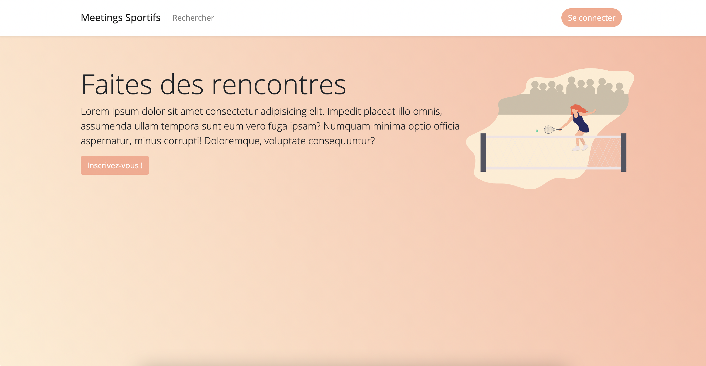
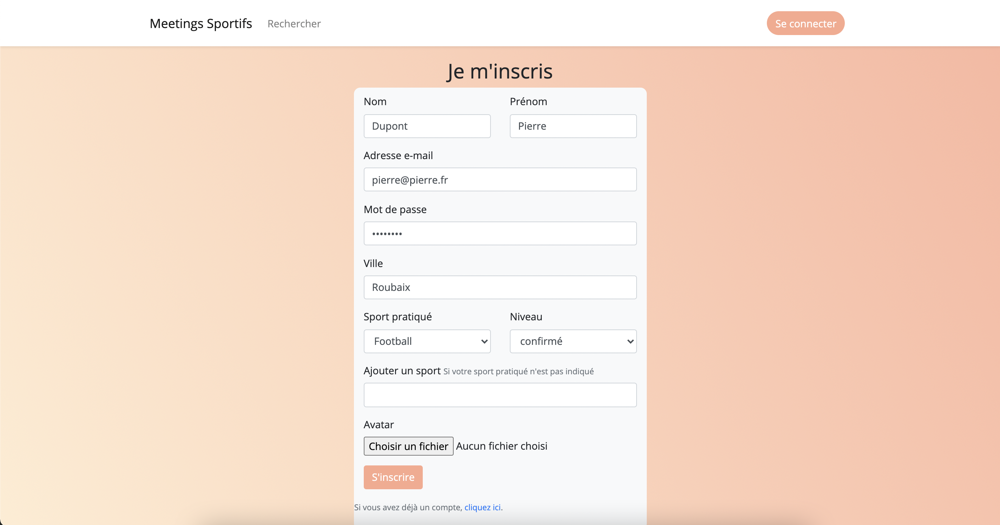
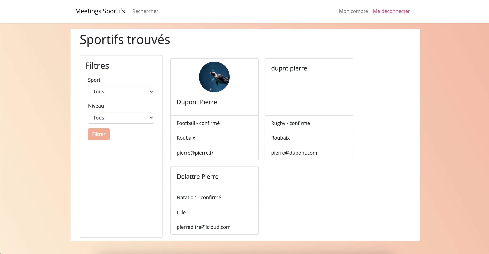
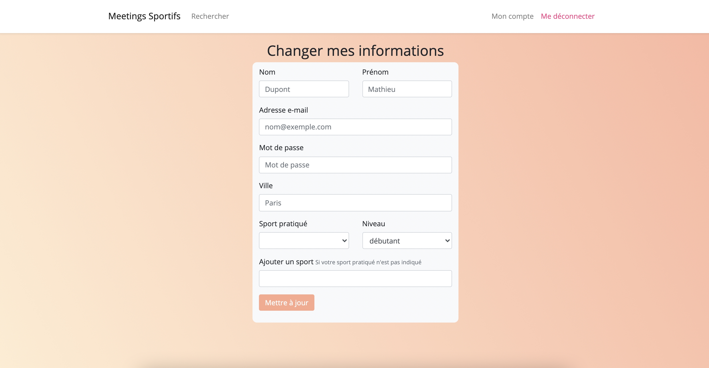

# Réalisation d’un site de rencontre autour du sport

Le site offre aux internautes sportifs la possibilité d’entrer en contact avec d’autres personnes pratiquantes le même sport.

Pour avoir accès aux informations du site, chaque visiteur s’enregistre au préalable en tant que pratiquant d’un sport.

L’identification  se  fait  par  le  biais  de  l’e-mail  du  visiteur et d’un mot de passe. 

Une  fois  identifié,  le visiteur a accès à une page de recherche affichant les coordonnées des personnes qui répondent au sport choisit.

Un  visiteur  non  enregistré  souhaitant  accéder  à  la  page  de  recherche  est  redirigé automatiquement vers la page d’inscription.

Si  un  visiteur  est déjà  identifié, il peut changer son sport ou ses informations à tout moment depuis la page profil.

 

# Le site comprend quatre pages indiquées comme suit :

## Page d’accueil
Contient la liste des sports extrait de la base de données. Un lien permet d’accéder à la page d’inscription
Un visiteur peut s’identifier depuis cette page en entrant son e-mail et un mot de passe. Une fois identifié, l’en-tête de la page se met à jour pour afficher deux nouveaux liens.
Un des liens permet d’accéder à la page de recherche et l’autre pour se déconnecter

## Page d’inscription 
Contient un formulaire. Le visiteur s’inscrit entrant ses informations personnelles, choisit un sport proposés en base de données et de son niveau (débutant, confirmé, pro).
Si son sport n’existe pas dans la base de données, il a la possibilité de l’ajouter lors de son inscription.

Après son inscription, le visiteur est amené à se connecter depuis la page d’accueil.
 

## Page de recherche 
Affiche les utilisateurs inscrit en base de données ainsi que les informations pour les contacter. Il est possible de trier les utilisateurs à partir de deux critères : le sport et le niveau de l’utilisateur.
 

## Page de profil
Permet à l’utilisateur identifié de modifier ses informations et aussi de changer / ajouter le sport et son niveau.

# Axes d'amélioration
- Listes des sports sur la page d'accueil
- Récupération des informations utilisateurs sur la page de profil afin d'éviter de tout réécrire
- Un filtre manquant dans la recherche
- MVC
